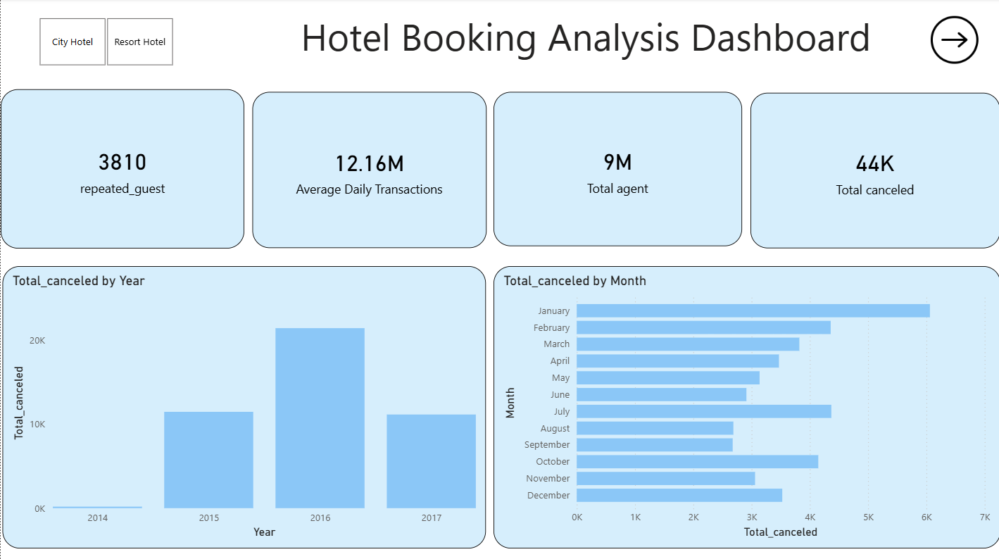
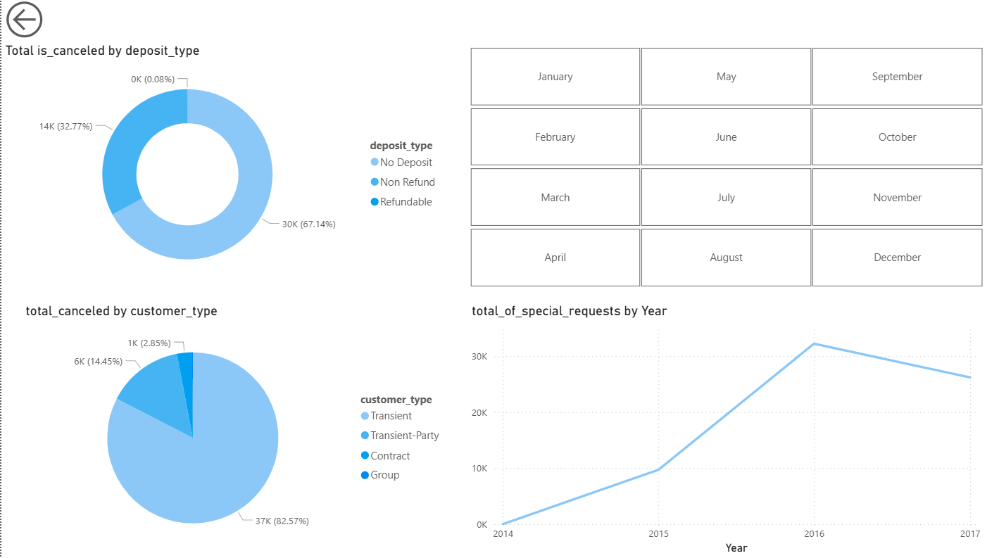

# 🏨 Hotel Booking Analysis Dashboard (Power BI)

## 📊 Project Overview
This Power BI dashboard analyzes hotel booking data to identify trends in cancellations, customer types, and yearly performance.

## 🔍 Key Insights
- 📈 Cancellation trend by year and month
- 🧾 Deposit type impact on cancellations
- 👥 Customer type distribution
- ⭐ Special requests trend

## 🛠 Tools Used
- Power BI
- DAX
- Data Cleaning in Power Query

## 📸 Dashboard Preview

## 🚀 Features
- Interactive slicers
- Clean UI design
- KPI Cards
- Multi-page navigation

---
Created by Shubham
